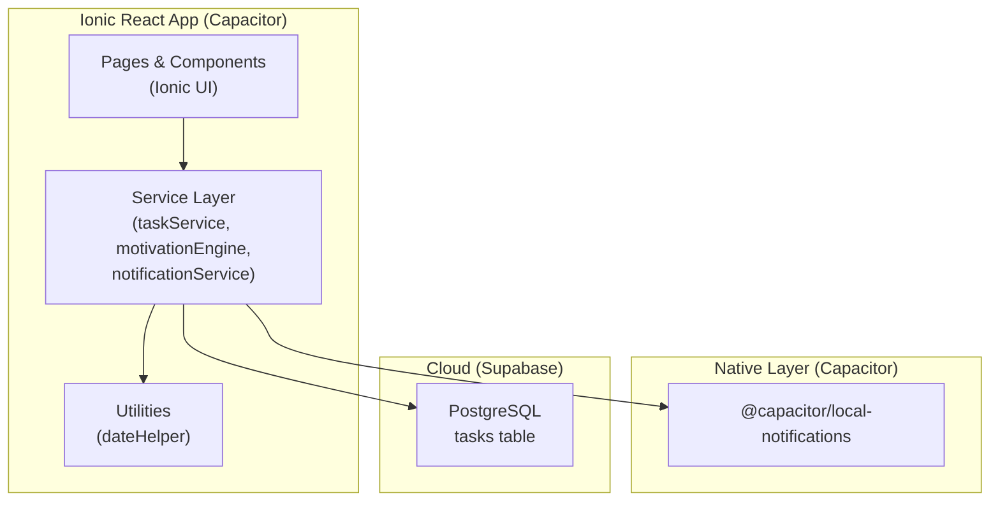
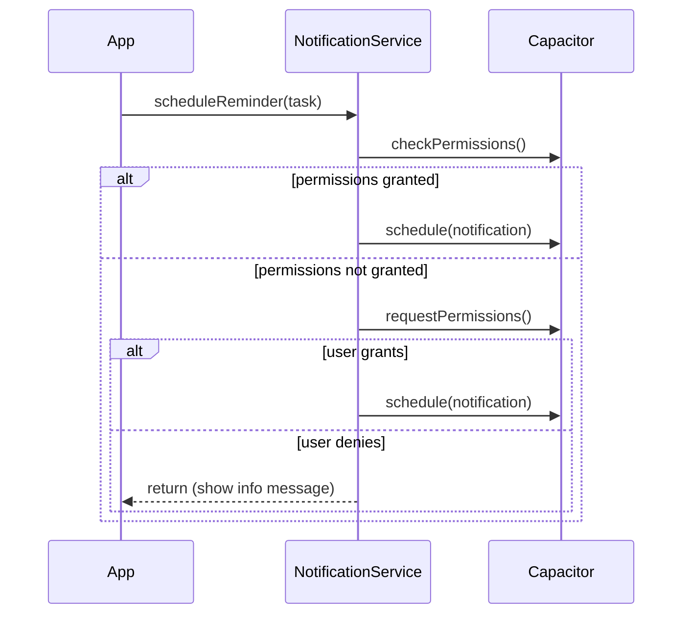
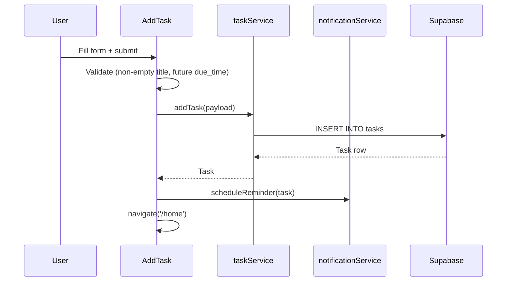
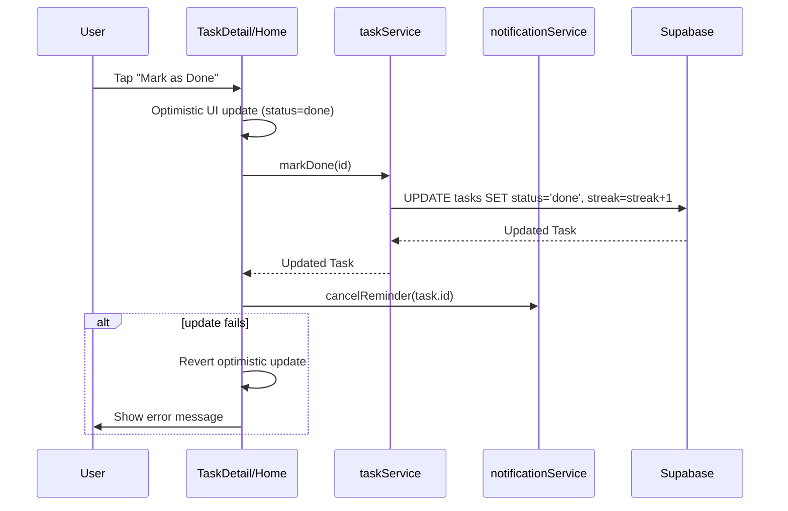

# Design Document

## Smart Motivation Task Reminder App

---

## Overview

The Smart Motivation Task Reminder App is a cross-platform mobile application built with **Ionic React** and **Capacitor**, backed by **Supabase** as the cloud database. Users create tasks with due-time reminders, track completion streaks, and receive contextual motivational messages from a rule-based motivation engine.

### Goals

- Lightweight task management with positive reinforcement
- Reliable local notifications via Capacitor
- Real-time-capable data layer via Supabase
- Smooth, native-feeling UI using Ionic components and transitions
- Dark mode support out of the box via Ionic CSS variables

### Key Design Decisions

| Decision | Choice | Rationale |
|---|---|---|
| Mobile framework | Ionic React + Capacitor | Cross-platform (iOS/Android/Web), React ecosystem, native plugin access |
| Notifications | `@capacitor/local-notifications` | No server required; fires at exact `due_time`; works offline |
| Database | Supabase (PostgreSQL) | Managed backend, real-time subscriptions, generous free tier |
| State management | React `useState` / `useEffect` + service layer | Avoids Redux overhead for a focused single-user app |
| Navigation | React Router v5 (Ionic React built-in) | Ionic's `IonRouterOutlet` requires RR v5 |
| Styling | Ionic CSS variables + `variables.css` | Dark mode, theming, and responsive layout with minimal custom CSS |

---

## Architecture



### Layer Responsibilities

**Pages / Components** — Pure presentation. Receive data as props or local state. Delegate all side effects to the service layer.

**Service Layer** — All business logic and I/O. Three services:
- `taskService.ts` — CRUD against Supabase `tasks` table
- `motivationEngine.ts` — Pure function; evaluates rules and returns a message string
- `notificationService.ts` — Wraps `@capacitor/local-notifications`; schedules and cancels notifications

**Utilities** — Stateless helpers (date formatting, future-date validation).

**Capacitor Native Layer** — Bridges JavaScript to OS-level notification APIs on iOS and Android.

**Supabase** — Hosted PostgreSQL. Accessed via `@supabase/supabase-js` client directly from the service layer.

---

## Components and Interfaces

### Pages

| Page | Route | Responsibility |
|---|---|---|
| `Home.tsx` | `/home` | Task list + MotivationBox |
| `AddTask.tsx` | `/add-task` | Form to create a new task |
| `TaskDetail.tsx` | `/task/:id` | Full task info + Mark as Done |
| `Dashboard.tsx` | `/dashboard` | Stats, badges, motivation score |

### Components

| Component | Props | Responsibility |
|---|---|---|
| `TaskCard.tsx` | `task: Task, onMarkDone: (id) => void` | Renders title, due time, status icon; tappable to navigate to detail |
| `MotivationBox.tsx` | `message: string` | Styled card displaying the motivational message |
| `BadgeDisplay.tsx` | `badges: Badge[]` | Renders earned badge chips/icons |

### Service Interfaces

```typescript
// Task domain model
interface Task {
  id: string;           // UUID
  title: string;
  description?: string;
  status: 'pending' | 'done';
  created_at: string;   // ISO 8601
  due_time: string;     // ISO 8601
  streak: number;
}

// Badge domain model
interface Badge {
  milestone: 3 | 7 | 30;
  label: string;        // e.g. "3-Day Streak"
  earned: boolean;
}

// taskService
interface TaskService {
  fetchTasks(): Promise<Task[]>;
  addTask(payload: Omit<Task, 'id' | 'created_at' | 'streak' | 'status'>): Promise<Task>;
  markDone(id: string): Promise<Task>;
  getTask(id: string): Promise<Task>;
}

// motivationEngine
interface MotivationEngine {
  getMessage(params: {
    streak: number;
    doneTasks: number;
    overdueTasks: number;
    now?: Date;
    rotationIndex?: number;
  }): string;
}

// notificationService
interface NotificationService {
  requestPermission(): Promise<boolean>;
  scheduleReminder(task: Task): Promise<void>;
  cancelReminder(taskId: string): Promise<void>;
}
```

---

## Data Models

### Supabase `tasks` Table

```sql
CREATE TABLE tasks (
  id          UUID        PRIMARY KEY DEFAULT gen_random_uuid(),
  title       TEXT        NOT NULL,
  description TEXT,
  status      TEXT        NOT NULL DEFAULT 'pending'
                          CHECK (status IN ('pending', 'done')),
  created_at  TIMESTAMPTZ NOT NULL DEFAULT now(),
  due_time    TIMESTAMPTZ NOT NULL,
  streak      INT         NOT NULL DEFAULT 0
);

-- Index for ordered task list queries
CREATE INDEX idx_tasks_due_time ON tasks (due_time ASC);
```

### Derived / In-Memory Models

```typescript
// Dashboard stats — computed client-side from Task[]
interface DashboardStats {
  totalTasks: number;
  completedTasks: number;
  currentStreak: number;   // max streak across all tasks
  motivationScore: number; // (completedTasks / totalTasks) * 100, rounded
  badges: Badge[];
}
```

### Badge Milestones

```typescript
const BADGE_MILESTONES: Array<{ milestone: 3 | 7 | 30; label: string }> = [
  { milestone: 3,  label: '3-Day Streak'  },
  { milestone: 7,  label: '7-Day Streak'  },
  { milestone: 30, label: '30-Day Streak' },
];
```

---

## Motivation Engine Algorithm

The motivation engine is a **pure function** — it takes numeric inputs and returns a string. No I/O, no side effects.

```
function getMessage(streak, doneTasks, overdueTasks, now, rotationIndex):

  // Step 1: Rule evaluation (priority order)
  if streak >= 3:
    base = "You're on fire 🔥 Keep going!"
  else if doneTasks > overdueTasks:
    base = "Great job! You're improving 💪"
  else if overdueTasks > 0:
    base = "Let's get back on track today!"
  else:
    base = DEFAULT_MESSAGES[rotationIndex % DEFAULT_MESSAGES.length]

  // Step 2: Time-of-day prefix
  hour = now.getHours()
  if 5 <= hour <= 11:
    return "Start strong! " + base
  else if 20 <= hour <= 23:
    return "Finish your tasks! " + base
  else:
    return base
```

**Default message pool** (used when no rule fires):

```typescript
const DEFAULT_MESSAGES = [
  "Every task completed is a step forward.",
  "Small progress is still progress.",
  "You've got this — one task at a time.",
  "Consistency beats perfection.",
];
```

**Rotation index** is stored in `localStorage` and incremented each day (keyed by date string) to prevent the same default message repeating on consecutive days.

---

## Notification Strategy (Capacitor)

### Permission Flow



### Notification Payload

```typescript
{
  id: numericIdFromUUID(task.id),  // LocalNotifications requires numeric ID
  title: task.title,
  body: "Time to complete your task!",
  schedule: { at: new Date(task.due_time) },
  extra: { taskId: task.id },
}
```

### Daily Repeat

For recurring daily reminders, the notification is rescheduled 24 hours after the original `due_time` when the task remains `pending`. This is handled in `notificationService.scheduleReminder` by checking the task status before scheduling.

### Tap-to-Navigate

`@capacitor/local-notifications` fires an `localNotificationActionPerformed` listener. The app registers this listener in `App.tsx` on mount:

```typescript
LocalNotifications.addListener('localNotificationActionPerformed', (action) => {
  const taskId = action.notification.extra?.taskId;
  if (taskId) history.push(`/task/${taskId}`);
});
```

---

## Data Flow

### Add Task Flow



### Mark as Done Flow



---

## Error Handling

| Scenario | Handling |
|---|---|
| Supabase fetch fails | Show `IonToast` with error message; retain stale data if available |
| Supabase write fails | Revert optimistic UI update; show `IonToast` |
| Notification permission denied | Show `IonAlert` explaining reminders won't fire; app continues normally |
| Invalid form submission | Inline validation messages below each field; do not submit |
| Task not found (detail view) | Show "Task not found" message with back navigation |
| Network offline | Supabase client throws; caught in service layer; surface via toast |

All service methods return `Promise<T>` and throw typed errors. Pages wrap calls in `try/catch` and set local error state.

---

## Package List (Exact Compatible Versions)

```json
{
  "dependencies": {
    "@capacitor/core": "^6.0.0",
    "@capacitor/local-notifications": "^6.0.0",
    "@capacitor/push-notifications": "^6.0.0",
    "@ionic/react": "^8.0.0",
    "@ionic/react-router": "^8.0.0",
    "@supabase/supabase-js": "^2.45.0",
    "ionicons": "^7.0.0",
    "react": "^18.2.0",
    "react-dom": "^18.2.0",
    "react-router": "^5.3.4",
    "react-router-dom": "^5.3.4"
  },
  "devDependencies": {
    "@capacitor/cli": "^6.0.0",
    "@types/react": "^18.2.0",
    "@types/react-dom": "^18.2.0",
    "@types/react-router": "^5.1.20",
    "@types/react-router-dom": "^5.3.3",
    "typescript": "^5.4.0",
    "vitest": "^1.6.0",
    "@vitest/coverage-v8": "^1.6.0",
    "fast-check": "^3.19.0"
  }
}
```

> **Note**: All `@capacitor/*` packages are pinned to the same major version (`^6.x`) as `@capacitor/core`. Ionic React uses React Router v5 — do **not** upgrade to v6 as `IonRouterOutlet` is incompatible with it.

---

## Testing Strategy

### Dual Testing Approach

The app uses both **unit/example-based tests** and **property-based tests** (PBT) for comprehensive coverage.

**Unit tests** cover:
- Specific form validation examples (empty title, past due time)
- Notification scheduling and cancellation calls (mocked Capacitor)
- Dashboard stat computation with concrete task arrays
- Badge award logic at exact milestone values

**Property-based tests** cover:
- Universal correctness properties of the motivation engine (pure function)
- Task validation logic across the full input space
- Dashboard stat computation invariants
- Streak/badge award logic across all streak values

### Property-Based Testing Setup

Library: **`fast-check`** (TypeScript-native, works with Vitest)

Each property test runs a minimum of **100 iterations**.

Tag format in test files:
```typescript
// Feature: smart-motivation-task-reminder, Property N: <property_text>
```

### Test File Structure

```
src/
├── services/
│   ├── __tests__/
│   │   ├── motivationEngine.test.ts   (unit + PBT)
│   │   ├── taskService.test.ts        (unit, mocked Supabase)
│   │   ├── notificationService.test.ts (unit, mocked Capacitor)
├── utils/
│   ├── __tests__/
│   │   ├── dateHelper.test.ts         (unit + PBT)
├── components/
│   ├── __tests__/
│   │   ├── dashboard.test.ts          (unit + PBT)
│   │   ├── badgeDisplay.test.ts       (unit + PBT)
```

### Integration Tests

- Supabase CRUD operations: tested against a local Supabase instance or with mocked `@supabase/supabase-js` client
- Notification scheduling: tested with mocked `@capacitor/local-notifications`

---

## Correctness Properties

*A property is a characteristic or behavior that should hold true across all valid executions of a system — essentially, a formal statement about what the system should do. Properties serve as the bridge between human-readable specifications and machine-verifiable correctness guarantees.*

The motivation engine, validation logic, dashboard stat computation, and badge award logic are all **pure functions** with clear input/output behavior and large input spaces. Property-based testing with `fast-check` is well-suited here. UI rendering, navigation, and infrastructure interactions are covered by example-based and integration tests instead.

---

### Property 1: Valid task submission always produces a pending task with zero streak

*For any* non-empty title string and future `due_time` timestamp, calling `addTask` with those values SHALL return a task with `status = 'pending'` and `streak = 0`.

**Validates: Requirements 1.2**

---

### Property 2: Empty or whitespace-only titles are always rejected

*For any* string composed entirely of whitespace characters (including the empty string), the task validation function SHALL return a validation error and SHALL NOT invoke `addTask`.

**Validates: Requirements 1.3**

---

### Property 3: Past due times are always rejected

*For any* timestamp that is strictly before the current time, the task validation function SHALL return a validation error and SHALL NOT invoke `addTask`.

**Validates: Requirements 1.4**

---

### Property 4: Scheduled notification always contains the task title

*For any* valid `Task` object, calling `notificationService.scheduleReminder(task)` SHALL schedule a notification whose title or body contains the task's `title` string.

**Validates: Requirements 1.5, 4.1**

---

### Property 5: Task list is always ordered by due_time ascending

*For any* array of tasks returned by `taskService.fetchTasks`, each task's `due_time` SHALL be less than or equal to the `due_time` of the next task in the array.

**Validates: Requirements 2.2**

---

### Property 6: TaskCard always renders all required fields

*For any* `Task` object, rendering a `TaskCard` SHALL produce output that contains the task's `title`, a formatted representation of `due_time`, and the task's `status`.

**Validates: Requirements 2.3**

---

### Property 7: Marking a task done always sets status and increments streak

*For any* task with `status = 'pending'` and any non-negative integer `streak` value `n`, calling `taskService.markDone(task.id)` SHALL return a task with `status = 'done'` and `streak = n + 1`.

**Validates: Requirements 3.1, 3.2**

---

### Property 8: Marking a task done always cancels its notification

*For any* task, after `taskService.markDone(task.id)` completes successfully, `notificationService.cancelReminder` SHALL have been called with that task's `id`.

**Validates: Requirements 3.4**

---

### Property 9: Daily reschedule is always exactly 24 hours after original due_time

*For any* `due_time` timestamp `t` and a pending task, the rescheduled notification SHALL be scheduled at `t + 86400000` milliseconds (24 hours).

**Validates: Requirements 4.2**

---

### Property 10: Motivation engine always applies correct rule priority

*For any* combination of `streak`, `doneTasks`, and `overdueTasks` values, the motivation engine SHALL return:
- A message containing "on fire" when `streak >= 3` (highest priority),
- A message containing "improving" when `streak < 3` and `doneTasks > overdueTasks`,
- A message containing "back on track" when `streak < 3`, `doneTasks <= overdueTasks`, and `overdueTasks > 0`,
- A default message otherwise.

**Validates: Requirements 5.1**

---

### Property 11: Morning time prefix is always applied for hours 5–11

*For any* valid `(streak, doneTasks, overdueTasks)` input and any `now` value where `now.getHours()` is in the range `[5, 11]`, the motivation engine's output SHALL start with `"Start strong!"`.

**Validates: Requirements 5.3**

---

### Property 12: Evening time prefix is always applied for hours 20–23

*For any* valid `(streak, doneTasks, overdueTasks)` input and any `now` value where `now.getHours()` is in the range `[20, 23]`, the motivation engine's output SHALL start with `"Finish your tasks!"`.

**Validates: Requirements 5.4**

---

### Property 13: Consecutive rotation indices produce different default messages

*For any* rotation index `n` where no rule fires (streak < 3, doneTasks ≤ overdueTasks, overdueTasks = 0), calling `getMessage` with `rotationIndex = n` and `rotationIndex = n + 1` SHALL return different messages (given a default message pool of size > 1).

**Validates: Requirements 5.5**

---

### Property 14: Dashboard stats are always computed correctly from task array

*For any* array of `Task` objects, `computeDashboardStats` SHALL return:
- `totalTasks` equal to the array length,
- `completedTasks` equal to the count of tasks with `status = 'done'`,
- `currentStreak` equal to the maximum `streak` value across all tasks (or `0` for an empty array),
- `motivationScore` equal to `Math.round((completedTasks / totalTasks) * 100)` or `0` when the array is empty.

**Validates: Requirements 6.1, 6.2, 6.3, 6.4**

---

### Property 15: Badge awards exactly match earned milestones

*For any* streak value `s`, the set of earned badges SHALL be exactly the set of milestone values `{3, 7, 30}` that are less than or equal to `s`. No badge SHALL be awarded for a milestone not yet reached, and no earned badge SHALL be omitted.

**Validates: Requirements 7.1, 7.2, 7.3, 7.4**

---

### Property 16: Task Detail always renders all five required fields

*For any* `Task` object, rendering the `TaskDetail` screen SHALL produce output that contains the task's `title`, `description`, formatted `due_time`, `status`, and `streak` value.

**Validates: Requirements 8.2**

---
